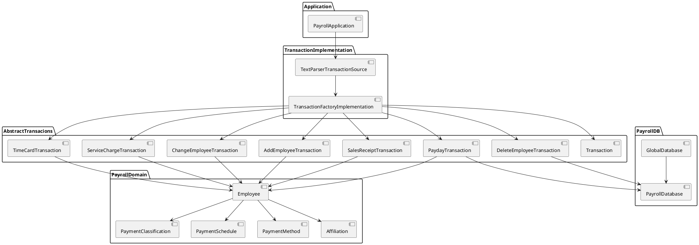
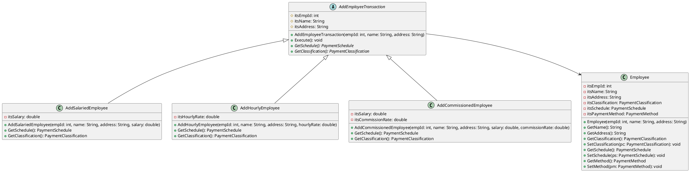
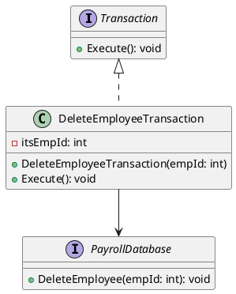
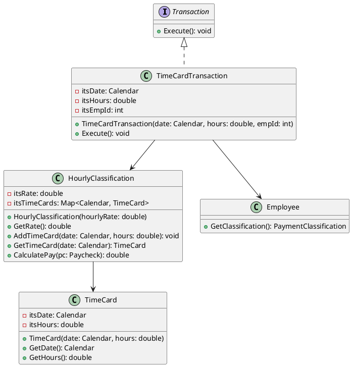
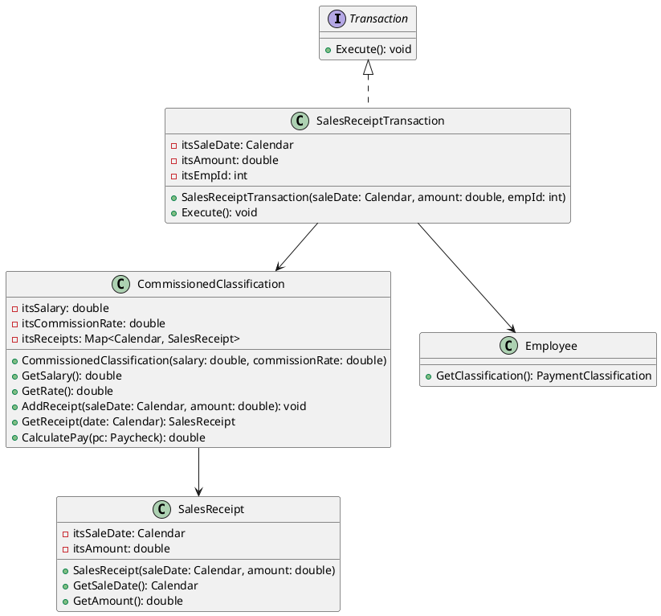
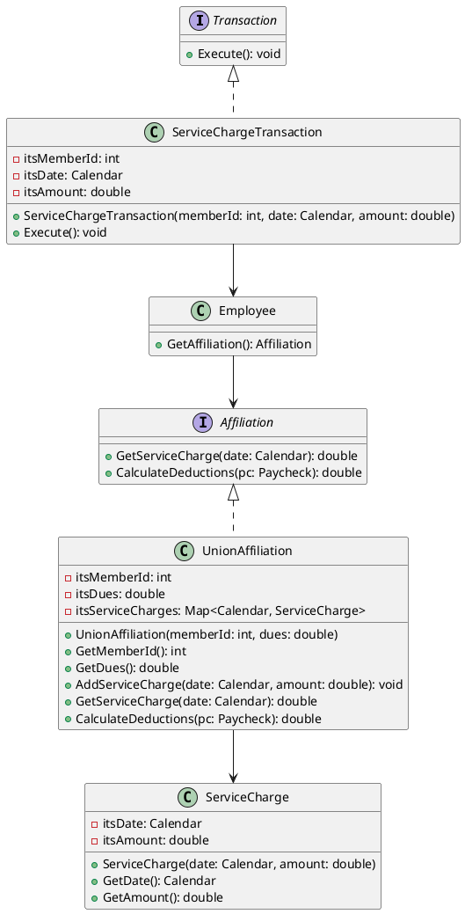
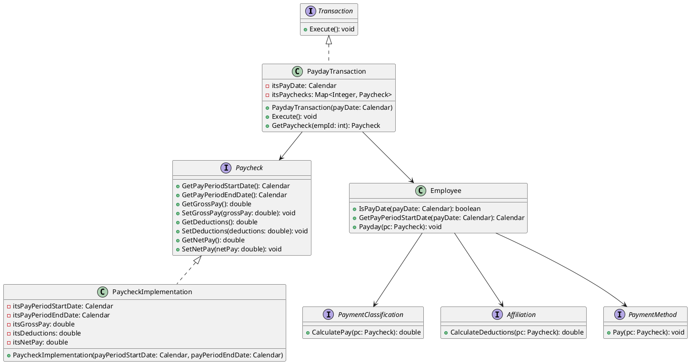

```plantuml
@startuml
interface Transaction {
  +Execute(): void
}

abstract class ChangeEmployeeTransaction {
  #itsEmpId: int
  +ChangeEmployeeTransaction(empId: int)
  +Execute(): void
  +{abstract} Change(e: Employee): void
}

abstract class ChangeClassificationTransaction {
  +Change(e: Employee): void
  +{abstract} GetSchedule(): PaymentSchedule
  +{abstract} GetClassification(): PaymentClassification
}

class ChangeHourlyTransaction {
  -itsRate: double
  +ChangeHourlyTransaction(empId: int, rate: double)
  +GetSchedule(): PaymentSchedule
  +GetClassification(): PaymentClassification
}

class ChangeSalariedTransaction {
  -itsSalary: double
  +ChangeSalariedTransaction(empId: int, salary: double)
  +GetSchedule(): PaymentSchedule
  +GetClassification(): PaymentClassification
}

class ChangeCommissionedTransaction {
  -itsSalary: double
  -itsRate: double
  +ChangeCommissionedTransaction(empId: int, salary: double, rate: double)
  +GetSchedule(): PaymentSchedule
  +GetClassification(): PaymentClassification
}

class ChangeNameTransaction {
  -itsName: String
  +ChangeNameTransaction(empId: int, name: String)
  +Change(e: Employee): void
}

class ChangeAddressTransaction {
  -itsAddress: String
  +ChangeAddressTransaction(empId: int, address: String)
  +Change(e: Employee): void
}

abstract class ChangeMethodTransaction {
  +Change(e: Employee): void
  +{abstract} GetMethod(): PaymentMethod
}

class ChangeDirectTransaction {
  -itsBank: String
  -itsAccount: String
  +ChangeDirectTransaction(empId: int, bank: String, account: String)
  +GetMethod(): PaymentMethod
}

class ChangeMailTransaction {
  -itsAddress: String
  +ChangeMailTransaction(empId: int, address: String)
  +GetMethod(): PaymentMethod
}

class ChangeHoldTransaction {
  +ChangeHoldTransaction(empId: int)
  +GetMethod(): PaymentMethod
}

abstract class ChangeAffiliationTransaction {
  +Change(e: Employee): void
  +{abstract} RecordMembership(e: Employee): void
  +{abstract} GetAffiliation(): Affiliation
}

class ChangeMemberTransaction {
  -itsMemberId: int
  -itsDues: double
  +ChangeMemberTransaction(empId: int, memberId: int, dues: double)
  +GetAffiliation(): Affiliation
  +RecordMembership(e: Employee): void
}

class ChangeUnaffiliatedTransaction {
  +ChangeUnaffiliatedTransaction(empId: int)
  +GetAffiliation(): Affiliation
  +RecordMembership(e: Employee): void
}

Transaction <|.. ChangeEmployeeTransaction
ChangeEmployeeTransaction <|-- ChangeClassificationTransaction
ChangeEmployeeTransaction <|-- ChangeNameTransaction
ChangeEmployeeTransaction <|-- ChangeAddressTransaction
ChangeEmployeeTransaction <|-- ChangeMethodTransaction
ChangeEmployeeTransaction <|-- ChangeAffiliationTransaction
ChangeClassificationTransaction <|-- ChangeHourlyTransaction
ChangeClassificationTransaction <|-- ChangeSalariedTransaction
ChangeClassificationTransaction <|-- ChangeCommissionedTransaction
ChangeMethodTransaction <|-- ChangeDirectTransaction
ChangeMethodTransaction <|-- ChangeMailTransaction
ChangeMethodTransaction <|-- ChangeHoldTransaction
ChangeAffiliationTransaction <|-- ChangeMemberTransaction
ChangeAffiliationTransaction <|-- ChangeUnaffiliatedTransaction
@enduml
```

# 給与システムの実装詳細

## はじめに

このドキュメントでは、2017年2月10日から2017年5月24日までに実施した給与システムの実装プロセスを解説します。実装はテスト駆動開発（TDD）の手法に従って行われ、段階的に機能を追加していきました。

このドキュメントを読むことで、給与システムの設計思想を理解し、自分で実装できるようになることを目指しています。

### 最終的なクラス構造

```plantuml
@startuml
package "PayrollDomain" {
  class Employee {
    -itsEmpId: int
    -itsName: String
    -itsAddress: String
    -itsClassification: PaymentClassification
    -itsSchedule: PaymentSchedule
    -itsPaymentMethod: PaymentMethod
    -itsAffiliation: Affiliation
    +Employee(empId: int, name: String, address: String)
    +GetName(): String
    +GetAddress(): String
    +GetClassification(): PaymentClassification
    +SetClassification(pc: PaymentClassification): void
    +GetSchedule(): PaymentSchedule
    +SetSchedule(ps: PaymentSchedule): void
    +GetMethod(): PaymentMethod
    +SetMethod(pm: PaymentMethod): void
    +GetAffiliation(): Affiliation
    +SetAffiliation(af: Affiliation): void
    +Payday(pc: Paycheck): void
    +IsPayDate(payDate: Calendar): boolean
    +GetPayPeriodStartDate(payDate: Calendar): Calendar
  }

  class Paycheck {
    -itsPayPeriodStartDate: Calendar
    -itsPayPeriodEndDate: Calendar
    -itsGrossPay: double
    -itsDeductions: double
    -itsNetPay: double
    +Paycheck(payPeriodStartDate: Calendar, payPeriodEndDate: Calendar)
    +GetPayPeriodEndDate(): Calendar
    +GetPayPeriodStartDate(): Calendar
    +SetGrossPay(grossPay: double): void
    +GetGrossPay(): double
    +SetDeductions(deductions: double): void
    +GetDeductions(): double
    +GetNetPay(): double
    +SetNetPay(netPay: double): void
  }

  interface PaymentClassification {
    +CalculatePay(pc: Paycheck): double
    +IsInPayPeriod(date: Calendar, pc: Paycheck): boolean
  }

  class HourlyClassification implements PaymentClassification {
    -itsRate: double
    -itsTimeCards: Map<Date, TimeCard>
    +HourlyClassification(hourlyRate: double)
    +GetRate(): double
    +AddTimeCard(tc: TimeCard): void
    +GetTimeCard(date: Calendar): TimeCard
    +CalculatePay(pc: Paycheck): double
  }

  class SalariedClassification implements PaymentClassification {
    -itsSalary: double
    +SalariedClassification(salary: double)
    +GetSalary(): double
    +CalculatePay(pc: Paycheck): double
  }

  class CommissionedClassification implements PaymentClassification {
    -itsSalary: double
    -itsCommissionRate: double
    -itsReceipts: Map<Date, SalesReceipt>
    +CommissionedClassification(salary: double, commissionRate: double)
    +AddSalesReceipt(sr: SalesReceipt): void
    +GetSalesReceipt(date: Calendar): SalesReceipt
    +GetSalary(): double
    +GetRate(): double
    +CalculatePay(pc: Paycheck): double
  }

  class TimeCard {
    -itsDate: Calendar
    -itsHours: double
    +TimeCard(date: Calendar, hours: double)
    +GetDate(): Calendar
    +GetHours(): double
  }

  class SalesReceipt {
    -itsDate: Calendar
    -itsAmount: double
    +SalesReceipt(date: Calendar, amount: double)
    +GetDate(): Calendar
    +GetAmount(): double
  }

  interface PaymentSchedule {
    +IsPayDate(payDate: Calendar): boolean
    +GetPayPeriodStartDate(payDate: Calendar): Calendar
  }

  class WeeklySchedule implements PaymentSchedule {
    +IsPayDate(payDate: Calendar): boolean
    +GetPayPeriodStartDate(payDate: Calendar): Calendar
  }

  class BiweeklySchedule implements PaymentSchedule {
    +IsPayDate(payDate: Calendar): boolean
    +GetPayPeriodStartDate(payDate: Calendar): Calendar
  }

  class MonthlySchedule implements PaymentSchedule {
    +IsPayDate(payDate: Calendar): boolean
    +GetPayPeriodStartDate(payDate: Calendar): Calendar
  }

  interface PaymentMethod {
    +Pay(pc: Paycheck): void
  }

  class DirectMethod implements PaymentMethod {
    -itsBank: String
    -itsAccount: String
    +DirectMethod(bank: String, account: String)
    +GetBank(): String
    +GetAccount(): String
    +Pay(pc: Paycheck): void
  }

  class HoldMethod implements PaymentMethod {
    +Pay(pc: Paycheck): void
  }

  class MailMethod implements PaymentMethod {
    -itsAddress: String
    +MailMethod(address: String)
    +GetAddress(): String
    +Pay(pc: Paycheck): void
  }

  interface Affiliation {
    +GetServiceCharge(date: long): double
    +CalculateDeductions(pc: Paycheck): double
  }

  class NoAffiliation implements Affiliation {
    +GetServiceCharge(date: long): double
    +CalculateDeductions(pc: Paycheck): double
  }

  class UnionAffiliation implements Affiliation {
    -itsMemberId: int
    -itsDues: double
    -itsServiceCharges: Map<Date, ServiceCharge>
    +UnionAffiliation(memberId: int, dues: double)
    +GetMemberId(): int
    +GetDues(): double
    +AddServiceCharge(sc: ServiceCharge): void
    +GetServiceCharge(date: long): double
    +CalculateDeductions(pc: Paycheck): double
  }

  class ServiceCharge {
    -itsDate: Calendar
    -itsAmount: double
    +ServiceCharge(date: Calendar, amount: double)
    +GetDate(): Calendar
    +GetAmount(): double
  }
}

package "PayrollDatabase" {
  class GlobalDatabase {
    +{static} payrollDB: PayrollDatabase
  }

  interface PayrollDatabase {
    +AddEmployee(empId: int, e: Employee): void
    +GetEmployee(empId: int): Employee
    +DeleteEmployee(empId: int): void
    +AddUnionMember(memberId: int, e: Employee): void
    +GetUnionMember(memberId: int): Employee
    +RemoveUnionMember(memberId: int): void
    +GetAllEmployeeIds(): List<Integer>
  }

  class PayrollDatabaseImplementation implements PayrollDatabase {
    -itsEmployees: Map<Integer, Employee>
    -itsUnionMembers: Map<Integer, Employee>
    +AddEmployee(empId: int, e: Employee): void
    +GetEmployee(empId: int): Employee
    +DeleteEmployee(empId: int): void
    +AddUnionMember(memberId: int, e: Employee): void
    +GetUnionMember(memberId: int): Employee
    +RemoveUnionMember(memberId: int): void
    +GetAllEmployeeIds(): List<Integer>
  }
}

package "AbstractTransacions" {
  interface Transaction {
    +Execute(): void
  }

  abstract class AddEmployeeTransaction implements Transaction {
    #itsEmpId: int
    #itsName: String
    #itsAddress: String
    +AddEmployeeTransaction(empId: int, name: String, address: String)
    +Execute(): void
    +{abstract} GetSchedule(): PaymentSchedule
    +{abstract} GetClassification(): PaymentClassification
  }

  class AddSalariedEmployee extends AddEmployeeTransaction {
    -itsSalary: double
    +AddSalariedEmployee(empId: int, name: String, address: String, salary: double)
    +GetSchedule(): PaymentSchedule
    +GetClassification(): PaymentClassification
  }

  class AddHourlyEmployee extends AddEmployeeTransaction {
    -itsHourlyRate: double
    +AddHourlyEmployee(empId: int, name: String, address: String, hourlyRate: double)
    +GetSchedule(): PaymentSchedule
    +GetClassification(): PaymentClassification
  }

  class AddCommissionedEmployee extends AddEmployeeTransaction {
    -itsSalary: double
    -itsCommissionRate: double
    +AddCommissionedEmployee(empId: int, name: String, address: String, salary: double, commissionRate: double)
    +GetSchedule(): PaymentSchedule
    +GetClassification(): PaymentClassification
  }

  abstract class ChangeEmployeeTransaction implements Transaction {
    #itsEmpId: int
    +ChangeEmployeeTransaction(empId: int)
    +Execute(): void
    +{abstract} Change(e: Employee): void
  }

  abstract class ChangeAffiliationTransaction extends ChangeEmployeeTransaction {
    +Change(e: Employee): void
    +{abstract} RecordMembership(e: Employee): void
    +{abstract} GetAffiliation(): Affiliation
  }

  class ChangeMemberTransaction extends ChangeAffiliationTransaction {
    -itsMemberId: int
    -itsDues: double
    +ChangeMemberTransaction(empId: int, memberId: int, dues: double)
    +GetAffiliation(): Affiliation
    +RecordMembership(e: Employee): void
  }

  class ChangeUnaffiliatedTransaction extends ChangeAffiliationTransaction {
    +ChangeUnaffiliatedTransaction(empId: int)
    +GetAffiliation(): Affiliation
    +RecordMembership(e: Employee): void
  }

  abstract class ChangeClassificationTransaction extends ChangeEmployeeTransaction {
    +Change(e: Employee): void
    +{abstract} GetSchedule(): PaymentSchedule
    +{abstract} GetClassification(): PaymentClassification
  }

  class ChangeHourlyTransaction extends ChangeClassificationTransaction {
    -itsRate: double
    +ChangeHourlyTransaction(empId: int, rate: double)
    +GetSchedule(): PaymentSchedule
    +GetClassification(): PaymentClassification
  }

  class ChangeSalariedTransaction extends ChangeClassificationTransaction {
    -itsSalary: double
    +ChangeSalariedTransaction(empId: int, salary: double)
    +GetSchedule(): PaymentSchedule
    +GetClassification(): PaymentClassification
  }

  class ChangeCommissionedTransaction extends ChangeClassificationTransaction {
    -itsSalary: double
    -itsRate: double
    +ChangeCommissionedTransaction(empId: int, salary: double, rate: double)
    +GetSchedule(): PaymentSchedule
    +GetClassification(): PaymentClassification
  }

  class DeleteEmployeeTransaction implements Transaction {
    -itsEmpId: int
    +DeleteEmployeeTransaction(empId: int)
    +Execute(): void
  }

  class TimeCardTransaction implements Transaction {
    -itsDate: Calendar
    -itsHours: double
    -itsEmpId: int
    +TimeCardTransaction(date: Calendar, hours: double, empId: int)
    +Execute(): void
  }

  class SalesReceiptTransaction implements Transaction {
    -itsDate: Calendar
    -itsAmount: double
    -itsEmpId: int
    +SalesReceiptTransaction(date: Calendar, amount: double, empId: int)
    +Execute(): void
  }

  class ServiceChargeTransaction implements Transaction {
    -itsMemberId: int
    -itsDate: Calendar
    -itsAmount: double
    +ServiceChargeTransaction(memberId: int, date: Calendar, amount: double)
    +Execute(): void
  }

  class PaydayTransaction implements Transaction {
    -itsPayDate: Calendar
    -itsPaychecks: Map<Integer, Paycheck>
    +PaydayTransaction(payDate: Calendar)
    +Execute(): void
    +GetPaycheck(empId: int): Paycheck
  }
}

package "TransactionImplementation" {
  interface TransactionSource {
    +GetTransaction(): Transaction
  }

  class TextParserTransactionSource implements TransactionSource {
    -itsReader: BufferedReader
    -itsFactory: TransactionFactory
    +TextParserTransactionSource(reader: BufferedReader, factory: TransactionFactory)
    +GetTransaction(): Transaction
  }

  interface TransactionFactory {
    +MakeAddHourlyEmployee(empId: int, name: String, address: String, hourlyRate: double): Transaction
    +MakeAddSalariedEmployee(empId: int, name: String, address: String, salary: double): Transaction
    +MakeAddCommissionedEmployee(empId: int, name: String, address: String, salary: double, commissionRate: double): Transaction
    +MakeDeleteEmployeeTransaction(empId: int): Transaction
    +MakeTimeCardTransaction(date: Calendar, hours: double, empId: int): Transaction
    +MakeSalesReceiptTransaction(date: Calendar, amount: double, empId: int): Transaction
    +MakeServiceChargeTransaction(memberId: int, date: Calendar, amount: double): Transaction
    +MakeChangeNameTransaction(empId: int, name: String): Transaction
    +MakeChangeAddressTransaction(empId: int, address: String): Transaction
    +MakeChangeHourlyTransaction(empId: int, hourlyRate: double): Transaction
    +MakeChangeSalariedTransaction(empId: int, salary: double): Transaction
    +MakeChangeCommissionedTransaction(empId: int, salary: double, commissionRate: double): Transaction
    +MakeChangeMailTransaction(empId: int, address: String): Transaction
    +MakeChangeDirectTransaction(empId: int, bank: String, account: String): Transaction
    +MakeChangeHoldTransaction(empId: int): Transaction
    +MakeChangeMemberTransaction(empId: int, memberId: int, dues: double): Transaction
    +MakeChangeUnaffiliatedTransaction(empId: int): Transaction
    +MakePaydayTransaction(payDate: Calendar): Transaction
  }

  class TransactionFactoryImplementation implements TransactionFactory {
    +MakeAddHourlyEmployee(empId: int, name: String, address: String, hourlyRate: double): Transaction
    +MakeAddSalariedEmployee(empId: int, name: String, address: String, salary: double): Transaction
    +MakeAddCommissionedEmployee(empId: int, name: String, address: String, salary: double, commissionRate: double): Transaction
    +MakeDeleteEmployeeTransaction(empId: int): Transaction
    +MakeTimeCardTransaction(date: Calendar, hours: double, empId: int): Transaction
    +MakeSalesReceiptTransaction(date: Calendar, amount: double, empId: int): Transaction
    +MakeServiceChargeTransaction(memberId: int, date: Calendar, amount: double): Transaction
    +MakeChangeNameTransaction(empId: int, name: String): Transaction
    +MakeChangeAddressTransaction(empId: int, address: String): Transaction
    +MakeChangeHourlyTransaction(empId: int, hourlyRate: double): Transaction
    +MakeChangeSalariedTransaction(empId: int, salary: double): Transaction
    +MakeChangeCommissionedTransaction(empId: int, salary: double, commissionRate: double): Transaction
    +MakeChangeMailTransaction(empId: int, address: String): Transaction
    +MakeChangeDirectTransaction(empId: int, bank: String, account: String): Transaction
    +MakeChangeHoldTransaction(empId: int): Transaction
    +MakeChangeMemberTransaction(empId: int, memberId: int, dues: double): Transaction
    +MakeChangeUnaffiliatedTransaction(empId: int): Transaction
    +MakePaydayTransaction(payDate: Calendar): Transaction
  }
}

package "Application" {
  class PayrollApplication {
    -itsTransactionSource: TransactionSource
    +PayrollApplication(source: TransactionSource)
    +Main(): void
  }
}

Employee --> PaymentClassification
Employee --> PaymentSchedule
Employee --> PaymentMethod
Employee --> Affiliation
HourlyClassification --> TimeCard
CommissionedClassification --> SalesReceipt
UnionAffiliation --> ServiceCharge
GlobalDatabase --> PayrollDatabase
PayrollDatabaseImplementation --> Employee
AddEmployeeTransaction --> Employee
ChangeEmployeeTransaction --> Employee
TimeCardTransaction --> HourlyClassification
SalesReceiptTransaction --> CommissionedClassification
ServiceChargeTransaction --> UnionAffiliation
PaydayTransaction --> Paycheck
TextParserTransactionSource --> TransactionFactory
PayrollApplication --> TransactionSource
@enduml
```



## 目次

1. [システム概要](#システム概要)
2. [アーキテクチャ](#アーキテクチャ)
3. [ドメインモデル](#ドメインモデル)
4. [トランザクション](#トランザクション)
5. [データベース](#データベース)
6. [ユースケース実装](#ユースケース実装)
   1. [ユースケース1: 従業員を追加する](#ユースケース1-従業員を追加する)
   2. [ユースケース2: 従業員を削除する](#ユースケース2-従業員を削除する)
   3. [ユースケース3: タイムカードの処理を要請する](#ユースケース3-タイムカードの処理を要請する)
   4. [ユースケース4: 売上げレシートの処理を要請する](#ユースケース4-売上げレシートの処理を要請する)
   5. [ユースケース5: 組合サービス料の処理を要請する](#ユースケース5-組合サービス料の処理を要請する)
   6. [ユースケース6: 従業員レコードの詳細を変更する](#ユースケース6-従業員レコードの詳細を変更する)
   7. [ユースケース7: 当日の給与支払い処理を走らせる](#ユースケース7-当日の給与支払い処理を走らせる)
7. [テスト駆動開発アプローチ](#テスト駆動開発アプローチ)
8. [リファクタリング](#リファクタリング)
9. [まとめ](#まとめ)

## システム概要

給与システムは、従業員の給与計算と支払いを管理するためのアプリケーションです。システムは以下の主要な機能を提供します：

- 従業員の追加・削除・変更
- タイムカード、売上レシート、組合サービス料の処理
- 給与計算と支払い処理

システムは以下の種類の従業員をサポートしています：

1. **時給従業員**：時給に基づいて給与が計算され、8時間を超える労働には1.5倍の時給が支払われます。給与は毎週金曜日に支払われます。
2. **固定給従業員**：月末に固定給が支払われます。
3. **成功報酬付き従業員**：固定給に加えて、売上に応じた成功報酬を受け取ります。給与は隔週金曜日に支払われます。

従業員は給与の受け取り方法を選択できます：
- 給与小切手を指定の住所に郵送
- 給与担当者が給与小切手を届けるまで待つ
- 指定した銀行口座に直接入金

また、従業員は組合に加入することができ、組合費や組合サービス料が給与から天引きされます。

## アーキテクチャ

給与システムは、以下のパッケージで構成されています：

1. **PayrollDomain**：システムのコアとなるドメインモデルを含みます。従業員、給与計算方法、支払いスケジュール、支払い方法などのクラスが含まれます。
2. **PayrollDatabase**：従業員データの永続化を担当します。
3. **AbstractTransacions**：システムの操作を表すトランザクションの抽象クラスとインターフェースを含みます。
4. **TransactionImplementation**：トランザクションの具体的な実装を含みます。
5. **Application**：アプリケーションのエントリーポイントとなるクラスを含みます。

### コンポーネント図

以下のコンポーネント図は、システムの主要なパッケージとその依存関係を示しています：



システムはトランザクションベースのアーキテクチャを採用しており、各操作（従業員の追加、タイムカードの処理など）は個別のトランザクションクラスとして実装されています。これにより、システムの拡張性と保守性が向上しています。

コンポーネント図からわかるように、アプリケーションはトランザクションソースを通じてトランザクションファクトリを使用し、様々なトランザクションを作成します。トランザクションはドメインモデルとデータベースを操作して、システムの機能を実現します。

## ドメインモデル

### Employee（従業員）

従業員クラスは、従業員の基本情報（ID、名前、住所）と、給与計算に関連する情報（給与計算方法、支払いスケジュール、支払い方法、所属）を保持します。

```java
public class Employee {
    private int itsEmpId;
    private String itsName;
    private String itsAddress;
    private PaymentClassification itsClassification;
    private PaymentSchedule itsSchedule;
    private PaymentMethod itsPaymentMethod;
    private Affiliation itsAffiliation;

    public Employee(int empId, String name, String address) {
        itsEmpId = empId;
        itsName = name;
        itsAddress = address;
        itsAffiliation = new NoAffiliation();
    }

    // ゲッター・セッターメソッド

    public void Payday(Paycheck pc) {
        double grossPay = itsClassification.CalculatePay(pc);
        double deductions = itsAffiliation.CalculateDeductions(pc);
        double netPay = grossPay - deductions;
        pc.SetGrossPay(grossPay);
        pc.SetDeductions(deductions);
        pc.SetNetPay(netPay);
        itsPaymentMethod.Pay(pc);
    }

    public boolean IsPayDate(Calendar payDate) {
        return itsSchedule.IsPayDate(payDate);
    }

    public Calendar GetPayPeriodStartDate(Calendar payDate) {
        return itsSchedule.GetPayPeriodStartDate(payDate);
    }
}
```

### PaymentClassification（給与計算方法）

給与計算方法は、従業員の給与タイプ（時給、固定給、成功報酬付き）に応じて給与を計算するためのインターフェースです。

```java
public interface PaymentClassification {
    double CalculatePay(Paycheck pc);
    boolean IsInPayPeriod(Calendar date, Paycheck pc);
}
```

#### HourlyClassification（時給計算）

```java
public class HourlyClassification implements PaymentClassification {
    private double itsRate;
    private Map<Date, TimeCard> itsTimeCards = new HashMap<>();

    public HourlyClassification(double hourlyRate) {
        itsRate = hourlyRate;
    }

    public void AddTimeCard(TimeCard tc) {
        itsTimeCards.put(tc.GetDate().getTime(), tc);
    }

    public TimeCard GetTimeCard(Calendar date) {
        return itsTimeCards.get(date.getTime());
    }

    public double CalculatePay(Paycheck pc) {
        double totalPay = 0;
        for (TimeCard tc : itsTimeCards.values()) {
            if (IsInPayPeriod(tc.GetDate(), pc)) {
                totalPay += CalculatePayForTimeCard(tc);
            }
        }
        return totalPay;
    }

    private double CalculatePayForTimeCard(TimeCard tc) {
        double hours = tc.GetHours();
        double overtime = Math.max(0.0, hours - 8.0);
        double straightTime = hours - overtime;
        return straightTime * itsRate + overtime * itsRate * 1.5;
    }

    public boolean IsInPayPeriod(Calendar date, Paycheck pc) {
        Calendar payPeriodEnd = pc.GetPayPeriodEndDate();
        Calendar payPeriodStart = pc.GetPayPeriodStartDate();
        return date.compareTo(payPeriodStart) >= 0 && date.compareTo(payPeriodEnd) <= 0;
    }
}
```

#### SalariedClassification（固定給計算）

```java
public class SalariedClassification implements PaymentClassification {
    private double itsSalary;

    public SalariedClassification(double salary) {
        itsSalary = salary;
    }

    public double GetSalary() {
        return itsSalary;
    }

    public double CalculatePay(Paycheck pc) {
        return itsSalary;
    }

    public boolean IsInPayPeriod(Calendar date, Paycheck pc) {
        return true;
    }
}
```

#### CommissionedClassification（成功報酬付き計算）

```java
public class CommissionedClassification implements PaymentClassification {
    private double itsSalary;
    private double itsCommissionRate;
    private Map<Date, SalesReceipt> itsReceipts = new HashMap<>();

    public CommissionedClassification(double salary, double commissionRate) {
        itsSalary = salary;
        itsCommissionRate = commissionRate;
    }

    public void AddSalesReceipt(SalesReceipt sr) {
        itsReceipts.put(sr.GetDate().getTime(), sr);
    }

    public SalesReceipt GetSalesReceipt(Calendar date) {
        return itsReceipts.get(date.getTime());
    }

    public double GetSalary() {
        return itsSalary;
    }

    public double GetRate() {
        return itsCommissionRate;
    }

    public double CalculatePay(Paycheck pc) {
        double commission = 0.0;
        for (SalesReceipt receipt : itsReceipts.values()) {
            if (IsInPayPeriod(receipt.GetDate(), pc)) {
                commission += receipt.GetAmount() * itsCommissionRate;
            }
        }
        return itsSalary + commission;
    }

    public boolean IsInPayPeriod(Calendar date, Paycheck pc) {
        Calendar payPeriodEnd = pc.GetPayPeriodEndDate();
        Calendar payPeriodStart = pc.GetPayPeriodStartDate();
        return date.compareTo(payPeriodStart) >= 0 && date.compareTo(payPeriodEnd) <= 0;
    }
}
```

### PaymentSchedule（支払いスケジュール）

支払いスケジュールは、従業員の給与支払い日を決定するためのインターフェースです。

```java
public interface PaymentSchedule {
    boolean IsPayDate(Calendar payDate);
    Calendar GetPayPeriodStartDate(Calendar payDate);
}
```

#### WeeklySchedule（週次スケジュール）

```java
public class WeeklySchedule implements PaymentSchedule {
    public boolean IsPayDate(Calendar payDate) {
        return payDate.get(Calendar.DAY_OF_WEEK) == Calendar.FRIDAY;
    }

    public Calendar GetPayPeriodStartDate(Calendar payDate) {
        Calendar periodStartDate = (Calendar) payDate.clone();
        periodStartDate.add(Calendar.DAY_OF_MONTH, -6);
        return periodStartDate;
    }
}
```

#### BiweeklySchedule（隔週スケジュール）

```java
public class BiweeklySchedule implements PaymentSchedule {
    private static final Calendar FirstPayableFriday = new GregorianCalendar(2001, Calendar.NOVEMBER, 9);

    public boolean IsPayDate(Calendar payDate) {
        if (payDate.get(Calendar.DAY_OF_WEEK) != Calendar.FRIDAY) {
            return false;
        }

        Calendar cal = (Calendar) FirstPayableFriday.clone();
        while (cal.compareTo(payDate) <= 0) {
            if (cal.equals(payDate)) {
                return true;
            }
            cal.add(Calendar.DAY_OF_MONTH, 14);
        }
        return false;
    }

    public Calendar GetPayPeriodStartDate(Calendar payDate) {
        Calendar periodStartDate = (Calendar) payDate.clone();
        periodStartDate.add(Calendar.DAY_OF_MONTH, -13);
        return periodStartDate;
    }
}
```

#### MonthlySchedule（月次スケジュール）

```java
public class MonthlySchedule implements PaymentSchedule {
    public boolean IsPayDate(Calendar payDate) {
        int lastDayOfMonth = payDate.getActualMaximum(Calendar.DAY_OF_MONTH);
        return payDate.get(Calendar.DAY_OF_MONTH) == lastDayOfMonth;
    }

    public Calendar GetPayPeriodStartDate(Calendar payDate) {
        Calendar periodStartDate = (Calendar) payDate.clone();
        periodStartDate.set(Calendar.DAY_OF_MONTH, 1);
        return periodStartDate;
    }
}
```

### PaymentMethod（支払い方法）

支払い方法は、従業員への給与の支払い方法を定義するインターフェースです。

```java
public interface PaymentMethod {
    void Pay(Paycheck pc);
}
```

#### DirectMethod（直接振込）

```java
public class DirectMethod implements PaymentMethod {
    private String itsBank;
    private String itsAccount;

    public DirectMethod(String bank, String account) {
        itsBank = bank;
        itsAccount = account;
    }

    public String GetBank() {
        return itsBank;
    }

    public String GetAccount() {
        return itsAccount;
    }

    public void Pay(Paycheck pc) {
        // 銀行口座に直接振り込む処理
    }
}
```

#### HoldMethod（窓口受け取り）

```java
public class HoldMethod implements PaymentMethod {
    public void Pay(Paycheck pc) {
        // 給与小切手を窓口で保管する処理
    }
}
```

#### MailMethod（郵送）

```java
public class MailMethod implements PaymentMethod {
    private String itsAddress;

    public MailMethod(String address) {
        itsAddress = address;
    }

    public String GetAddress() {
        return itsAddress;
    }

    public void Pay(Paycheck pc) {
        // 給与小切手を郵送する処理
    }
}
```

### Affiliation（所属）

所属は、従業員の組合加入状況を表すインターフェースです。

```java
public interface Affiliation {
    double GetServiceCharge(long date);
    double CalculateDeductions(Paycheck pc);
}
```

#### NoAffiliation（未加入）

```java
public class NoAffiliation implements Affiliation {
    public double GetServiceCharge(long date) {
        return 0;
    }

    public double CalculateDeductions(Paycheck pc) {
        return 0;
    }
}
```

#### UnionAffiliation（組合加入）

```java
public class UnionAffiliation implements Affiliation {
    private int itsMemberId;
    private double itsDues;
    private Map<Date, ServiceCharge> itsServiceCharges = new HashMap<>();

    public UnionAffiliation(int memberId, double dues) {
        itsMemberId = memberId;
        itsDues = dues;
    }

    public void AddServiceCharge(ServiceCharge sc) {
        itsServiceCharges.put(sc.GetDate().getTime(), sc);
    }

    public ServiceCharge GetServiceCharge(long date) {
        return itsServiceCharges.get(date);
    }

    public double CalculateDeductions(Paycheck pc) {
        double totalDues = 0;
        int fridays = NumberOfFridaysInPayPeriod(pc.GetPayPeriodStartDate(), pc.GetPayPeriodEndDate());
        totalDues = itsDues * fridays;

        for (ServiceCharge sc : itsServiceCharges.values()) {
            if (IsInPayPeriod(sc.GetDate(), pc)) {
                totalDues += sc.GetAmount();
            }
        }
        return totalDues;
    }

    private boolean IsInPayPeriod(Calendar date, Paycheck pc) {
        Calendar payPeriodEnd = pc.GetPayPeriodEndDate();
        Calendar payPeriodStart = pc.GetPayPeriodStartDate();
        return date.compareTo(payPeriodStart) >= 0 && date.compareTo(payPeriodEnd) <= 0;
    }

    private int NumberOfFridaysInPayPeriod(Calendar payPeriodStart, Calendar payPeriodEnd) {
        int fridays = 0;
        Calendar cal = (Calendar) payPeriodStart.clone();
        while (cal.compareTo(payPeriodEnd) <= 0) {
            if (cal.get(Calendar.DAY_OF_WEEK) == Calendar.FRIDAY) {
                fridays++;
            }
            cal.add(Calendar.DAY_OF_MONTH, 1);
        }
        return fridays;
    }
}
```

### Paycheck（給与小切手）

給与小切手は、給与支払い処理の結果を表すクラスです。

```java
public class Paycheck {
    private Calendar itsPayPeriodStartDate;
    private Calendar itsPayPeriodEndDate;
    private double itsGrossPay;
    private double itsDeductions;
    private double itsNetPay;

    public Paycheck(Calendar payPeriodStartDate, Calendar payPeriodEndDate) {
        itsPayPeriodStartDate = payPeriodStartDate;
        itsPayPeriodEndDate = payPeriodEndDate;
    }

    public Calendar GetPayPeriodEndDate() {
        return itsPayPeriodEndDate;
    }

    public Calendar GetPayPeriodStartDate() {
        return itsPayPeriodStartDate;
    }

    public void SetGrossPay(double grossPay) {
        itsGrossPay = grossPay;
    }

    public double GetGrossPay() {
        return itsGrossPay;
    }

    public void SetDeductions(double deductions) {
        itsDeductions = deductions;
    }

    public double GetDeductions() {
        return itsDeductions;
    }

    public double GetNetPay() {
        return itsNetPay;
    }

    public void SetNetPay(double netPay) {
        itsNetPay = netPay;
    }
}
```

## トランザクション

トランザクションは、システムの操作を表すクラスです。各トランザクションは、特定の操作（従業員の追加、タイムカードの処理など）を実行します。

### Transaction（トランザクション）

```java
public interface Transaction {
    void Execute();
}
```

### AddEmployeeTransaction（従業員追加トランザクション）

```java
public abstract class AddEmployeeTransaction implements Transaction {
    protected int itsEmpId;
    protected String itsName;
    protected String itsAddress;

    public AddEmployeeTransaction(int empId, String name, String address) {
        itsEmpId = empId;
        itsName = name;
        itsAddress = address;
    }

    public void Execute() {
        PaymentClassification pc = GetClassification();
        PaymentSchedule ps = GetSchedule();
        PaymentMethod pm = new HoldMethod();

        Employee e = new Employee(itsEmpId, itsName, itsAddress);
        e.SetClassification(pc);
        e.SetSchedule(ps);
        e.SetMethod(pm);

        GlobalDatabase.payrollDB.AddEmployee(itsEmpId, e);
    }

    public abstract PaymentSchedule GetSchedule();
    public abstract PaymentClassification GetClassification();
}
```

#### AddSalariedEmployee（固定給従業員追加）

```java
public class AddSalariedEmployee extends AddEmployeeTransaction {
    private double itsSalary;

    public AddSalariedEmployee(int empId, String name, String address, double salary) {
        super(empId, name, address);
        itsSalary = salary;
    }

    public PaymentSchedule GetSchedule() {
        return new MonthlySchedule();
    }

    public PaymentClassification GetClassification() {
        return new SalariedClassification(itsSalary);
    }
}
```

#### AddHourlyEmployee（時給従業員追加）

```java
public class AddHourlyEmployee extends AddEmployeeTransaction {
    private double itsHourlyRate;

    public AddHourlyEmployee(int empId, String name, String address, double hourlyRate) {
        super(empId, name, address);
        itsHourlyRate = hourlyRate;
    }

    public PaymentSchedule GetSchedule() {
        return new WeeklySchedule();
    }

    public PaymentClassification GetClassification() {
        return new HourlyClassification(itsHourlyRate);
    }
}
```

#### AddCommissionedEmployee（成功報酬付き従業員追加）

```java
public class AddCommissionedEmployee extends AddEmployeeTransaction {
    private double itsSalary;
    private double itsCommissionRate;

    public AddCommissionedEmployee(int empId, String name, String address, double salary, double commissionRate) {
        super(empId, name, address);
        itsSalary = salary;
        itsCommissionRate = commissionRate;
    }

    public PaymentSchedule GetSchedule() {
        return new BiweeklySchedule();
    }

    public PaymentClassification GetClassification() {
        return new CommissionedClassification(itsSalary, itsCommissionRate);
    }
}
```

### DeleteEmployeeTransaction（従業員削除トランザクション）

```java
public class DeleteEmployeeTransaction implements Transaction {
    private int itsEmpId;

    public DeleteEmployeeTransaction(int empId) {
        itsEmpId = empId;
    }

    public void Execute() {
        GlobalDatabase.payrollDB.DeleteEmployee(itsEmpId);
    }
}
```

### TimeCardTransaction（タイムカードトランザクション）

```java
public class TimeCardTransaction implements Transaction {
    private Calendar itsDate;
    private double itsHours;
    private int itsEmpId;

    public TimeCardTransaction(Calendar date, double hours, int empId) {
        itsDate = date;
        itsHours = hours;
        itsEmpId = empId;
    }

    public void Execute() {
        Employee e = GlobalDatabase.payrollDB.GetEmployee(itsEmpId);
        if (e != null) {
            PaymentClassification pc = e.GetClassification();
            if (pc instanceof HourlyClassification) {
                HourlyClassification hc = (HourlyClassification) pc;
                hc.AddTimeCard(new TimeCard(itsDate, itsHours));
            } else {
                throw new RuntimeException("Tried to add timecard to non-hourly employee");
            }
        } else {
            throw new RuntimeException("No such employee.");
        }
    }
}
```

### SalesReceiptTransaction（売上レシートトランザクション）

```java
public class SalesReceiptTransaction implements Transaction {
    private Calendar itsDate;
    private double itsAmount;
    private int itsEmpId;

    public SalesReceiptTransaction(Calendar date, double amount, int empId) {
        itsDate = date;
        itsAmount = amount;
        itsEmpId = empId;
    }

    public void Execute() {
        Employee e = GlobalDatabase.payrollDB.GetEmployee(itsEmpId);
        if (e != null) {
            PaymentClassification pc = e.GetClassification();
            if (pc instanceof CommissionedClassification) {
                CommissionedClassification cc = (CommissionedClassification) pc;
                cc.AddSalesReceipt(new SalesReceipt(itsDate, itsAmount));
            } else {
                throw new RuntimeException("Tried to add sales receipt to non-commissioned employee");
            }
        } else {
            throw new RuntimeException("No such employee.");
        }
    }
}
```

### ServiceChargeTransaction（サービス料トランザクション）

```java
public class ServiceChargeTransaction implements Transaction {
    private int itsMemberId;
    private Calendar itsDate;
    private double itsAmount;

    public ServiceChargeTransaction(int memberId, Calendar date, double amount) {
        itsMemberId = memberId;
        itsDate = date;
        itsAmount = amount;
    }

    public void Execute() {
        Employee e = GlobalDatabase.payrollDB.GetUnionMember(itsMemberId);
        if (e != null) {
            Affiliation af = e.GetAffiliation();
            if (af instanceof UnionAffiliation) {
                UnionAffiliation uaf = (UnionAffiliation) af;
                uaf.AddServiceCharge(new ServiceCharge(itsDate, itsAmount));
            } else {
                throw new RuntimeException("Tried to add service charge to non-union member");
            }
        } else {
            throw new RuntimeException("No such union member.");
        }
    }
}
```

### PaydayTransaction（給与支払いトランザクション）

```java
public class PaydayTransaction implements Transaction {
    private Calendar itsPayDate;
    private Map<Integer, Paycheck> itsPaychecks = new HashMap<>();

    public PaydayTransaction(Calendar payDate) {
        itsPayDate = payDate;
    }

    public void Execute() {
        List<Integer> empIds = GlobalDatabase.payrollDB.GetAllEmployeeIds();
        for (int empId : empIds) {
            Employee e = GlobalDatabase.payrollDB.GetEmployee(empId);
            if (e.IsPayDate(itsPayDate)) {
                Calendar startDate = e.GetPayPeriodStartDate(itsPayDate);
                Paycheck pc = new Paycheck(startDate, itsPayDate);
                e.Payday(pc);
                itsPaychecks.put(empId, pc);
            }
        }
    }

    public Paycheck GetPaycheck(int empId) {
        return itsPaychecks.get(empId);
    }
}
```

## データベース

データベースは、従業員データの永続化を担当します。

### PayrollDatabase（給与データベース）

```java
public interface PayrollDatabase {
    void AddEmployee(int empId, Employee e);
    Employee GetEmployee(int empId);
    void DeleteEmployee(int empId);
    void AddUnionMember(int memberId, Employee e);
    Employee GetUnionMember(int memberId);
    void RemoveUnionMember(int memberId);
    List<Integer> GetAllEmployeeIds();
}
```

### PayrollDatabaseImplementation（給与データベース実装）

```java
public class PayrollDatabaseImplementation implements PayrollDatabase {
    private Map<Integer, Employee> itsEmployees = new HashMap<>();
    private Map<Integer, Employee> itsUnionMembers = new HashMap<>();

    public void AddEmployee(int empId, Employee e) {
        itsEmployees.put(empId, e);
    }

    public Employee GetEmployee(int empId) {
        return itsEmployees.get(empId);
    }

    public void DeleteEmployee(int empId) {
        itsEmployees.remove(empId);
    }

    public void AddUnionMember(int memberId, Employee e) {
        itsUnionMembers.put(memberId, e);
    }

    public Employee GetUnionMember(int memberId) {
        return itsUnionMembers.get(memberId);
    }

    public void RemoveUnionMember(int memberId) {
        itsUnionMembers.remove(memberId);
    }

    public List<Integer> GetAllEmployeeIds() {
        return new ArrayList<>(itsEmployees.keySet());
    }
}
```

### GlobalDatabase（グローバルデータベース）

```java
public class GlobalDatabase {
    public static PayrollDatabase payrollDB = new PayrollDatabaseImplementation();
}
```

## ユースケース実装

### ユースケース1: 従業員を追加する

#### 目標
- 新しい従業員を給与システムに追加する
- 従業員の種類（時給、固定給、成功報酬付き）に応じた給与計算方法と支払いスケジュールを設定する
- 従業員の支払い方法を設定する

#### クラス図



#### 実装手順

1. **テストの作成**: まず、従業員を追加するテストを作成します。

```java
public void testAddSalariedEmployee() {
    System.err.println("TestAddSalariedEmployee");
    int empId = 1;
    AddSalariedEmployee t = new AddSalariedEmployee(empId, "Bob", "Home", 1000.00);
    t.Execute();
    Employee e = PayrollDatabase.GetEmployee(empId);
    assertNotNull(e);
    assertEquals("Bob", e.GetName());
    PaymentClassification pc = e.GetClassification();
    SalariedClassification sc = (SalariedClassification) pc;
    assertNotNull(sc);
    assertEquals(1000.00, sc.GetSalary());
    PaymentSchedule ps = e.GetSchedule();
    MonthlySchedule ms = (MonthlySchedule) ps;
    assertNotNull(ms);
    PaymentMethod pm = e.GetMethod();
    HoldMethod hm = (HoldMethod) pm;
    assertNotNull(hm);
}
```

2. **ドメインクラスの実装**: テストを実行するために必要なドメインクラスを実装します。

```java
class Employee {
    private int itsEmpId;
    private String itsName;
    private String itsAddress;
    private PaymentClassification itsClassification;
    private PaymentSchedule itsSchedule;
    private PaymentMethod itsPaymentMethod;

    public Employee(int empId, String name, String address) {
        itsEmpId = empId;
        itsName = name;
        itsAddress = address;
    }

    // ゲッター・セッターメソッド
}
```

3. **抽象トランザクションクラスの実装**: 従業員追加の共通処理を行う抽象クラスを実装します。

```java
abstract class AddEmployeeTransaction {
    private int itsEmpId;
    private String itsName;
    private String itsAddress;

    public AddEmployeeTransaction(int empId, String name, String address) {
        itsEmpId = empId;
        itsName = name;
        itsAddress = address;
    }

    public void Execute() {
        PaymentClassification pc = GetClassification();
        PaymentSchedule ps = GetSchedule();
        PaymentMethod pm = new HoldMethod();
        Employee e = new Employee(itsEmpId, itsName, itsAddress);
        e.SetClassification(pc);
        e.SetSchedule(ps);
        e.SetMethod(pm);
        PayrollDatabase.AddEmployee(itsEmpId, e);
    }

    abstract PaymentSchedule GetSchedule();
    abstract PaymentClassification GetClassification();
}
```

4. **具象トランザクションクラスの実装**: 各種従業員タイプに対応する具象クラスを実装します。

```java
class AddSalariedEmployee extends AddEmployeeTransaction {
    private double itsSalary;

    public AddSalariedEmployee(int empId, String name, String address, double salary) {
        super(empId, name, address);
        itsSalary = salary;
    }

    public PaymentClassification GetClassification() {
        return new SalariedClassification(itsSalary);
    }

    public PaymentSchedule GetSchedule() {
        return new MonthlySchedule();
    }
}
```

5. **リファクタリング**: 後のイテレーションで、ファクトリーパターンを導入してオブジェクト生成を改善しました。

```java
public AddSalariedEmployee(int empId, String name, String address, double salary, PayrollFactory payrollFactory) {
    super(empId, name, address, payrollFactory);
    itsSalary = salary;
}

public PaymentClassification GetClassification() {
    return itsPayrollFactory.makeSalariedClassification(itsSalary);
}

public PaymentSchedule GetSchedule() {
    return itsPayrollFactory.makeMonthlySchedule();
}
```

#### 使用例

```java
// 固定給従業員の追加
int empId = 1;
String name = "Bob";
String address = "Home";
double salary = 1000.00;

AddSalariedEmployee t = new AddSalariedEmployee(empId, name, address, salary, payrollFactory);
t.Execute();

// 時給従業員の追加
int empId = 2;
String name = "Bill";
String address = "Home";
double hourlyRate = 15.25;

AddHourlyEmployee t = new AddHourlyEmployee(empId, name, address, hourlyRate, payrollFactory);
t.Execute();

// 成功報酬付き従業員の追加
int empId = 3;
String name = "Lance";
String address = "Home";
double salary = 2500.0;
double commissionRate = 0.032;

AddCommissionedEmployee t = new AddCommissionedEmployee(empId, name, address, salary, commissionRate, payrollFactory);
t.Execute();
```

#### 設計の考察

この実装では、テンプレートメソッドパターンを使用して、従業員追加の共通処理を抽象クラスに定義し、従業員タイプ固有の処理をサブクラスに委譲しています。これにより、コードの重複を避けつつ、新しい従業員タイプの追加が容易になっています。

また、後のイテレーションでは、ファクトリーパターンを導入して、オブジェクト生成の責任を分離しています。これにより、テストの際にモックオブジェクトを使用することが容易になり、テスト可能性が向上しています。

### ユースケース2: 従業員を削除する

#### 目標
- 指定されたIDの従業員を給与システムから削除する
- 削除された従業員はシステムから完全に削除され、アクセスできなくなる

#### クラス図



#### 実装手順

1. **テストの作成**: まず、従業員を削除するテストを作成します。

```java
public void testDeleteEmployee() {
    System.err.println("TestDeleteEmployee");
    int empId = 3;
    AddCommissionedEmployee t = makeCommissionedEmployee(empId);
    t.Execute();
    Employee e = GlobalDatabase.payrollDB.GetEmployee(empId);
    assertNotNull(e);
    DeleteEmployeeTransaction dt = new DeleteEmployeeTransaction(empId);
    dt.Execute();
    e = GlobalDatabase.payrollDB.GetEmployee(empId);
    assertNull(e);
}
```

2. **トランザクションクラスの実装**: テストを実行するために必要なトランザクションクラスを実装します。

```java
public class DeleteEmployeeTransaction implements Transaction {
    private int itsEmpId;

    public DeleteEmployeeTransaction(int empId) {
        itsEmpId = empId;
    }

    public void Execute() {
        GlobalDatabase.payrollDB.DeleteEmployee(itsEmpId);
    }
}
```

3. **データベースの実装**: 従業員を削除するためのデータベースメソッドを実装します。

```java
public void DeleteEmployee(int empId) {
    itsEmployees.remove(empId);
}
```

#### 使用例

```java
// 従業員の削除
int empId = 3;

DeleteEmployeeTransaction dt = new DeleteEmployeeTransaction(empId);
dt.Execute();
```

#### 設計の考察

この実装では、コマンドパターンを使用して、従業員削除の操作をカプセル化しています。DeleteEmployeeTransactionクラスは、従業員IDを保持し、Executeメソッドで実際の削除処理を行います。

この設計により、削除操作を一つのオブジェクトとして扱うことができ、操作の実行を遅延させたり、操作をキューに入れたりすることが可能になります。また、トランザクションオブジェクトを保存しておくことで、操作の履歴を管理したり、操作を取り消したりすることも可能になります。

### ユースケース3: タイムカードの処理を要請する

#### 目標
- 時給従業員のタイムカードを処理する
- タイムカードの日付と労働時間を記録する
- タイムカードを適切な従業員の給与計算に反映させる

#### クラス図



#### 実装手順

1. **テストの作成**: まず、タイムカードを処理するテストを作成します。

```java
public void testTimeCardTransaction() {
    System.err.println("TestTimeCardTransaction");
    int empId = 2;
    AddHourlyEmployee t = makeHourlyEmployee(empId);
    t.Execute();
    Calendar date = new GregorianCalendar(2001, Calendar.OCTOBER, 31);
    TimeCardTransaction tct = new TimeCardTransaction(date, 8.0, empId);
    tct.Execute();
    Employee e = GlobalDatabase.payrollDB.GetEmployee(empId);
    assertNotNull(e);
    PaymentClassification pc = e.GetClassification();
    HourlyClassification hc = (HourlyClassification) pc;
    assertNotNull(hc);
    TimeCard tc = hc.GetTimeCard(date);
    assertNotNull(tc);
    assertEquals(8.0, tc.GetHours());
}
```

2. **TimeCardTransaction クラスの実装**: テストを実行するために必要なトランザクションクラスを実装します。

```java
public class TimeCardTransaction implements Transaction {
    private Calendar itsDate;
    private double itsHours;
    private int itsEmpId;

    public TimeCardTransaction(Calendar date, double hours, int empId) {
        itsDate = date;
        itsHours = hours;
        itsEmpId = empId;
    }

    public void Execute() {
        Employee e = GlobalDatabase.payrollDB.GetEmployee(itsEmpId);
        if (e != null) {
            PaymentClassification pc = e.GetClassification();
            if (pc instanceof HourlyClassification) {
                HourlyClassification hc = (HourlyClassification) pc;
                hc.AddTimeCard(itsDate, itsHours);
            } else {
                throw new RuntimeException("Tried to add timecard to non-hourly employee.");
            }
        } else {
            throw new RuntimeException("No such employee.");
        }
    }
}
```

3. **TimeCard クラスの実装**: タイムカードを表すクラスを実装します。

```java
public class TimeCard {
    private Calendar itsDate;
    private double itsHours;

    public TimeCard(Calendar date, double hours) {
        itsDate = date;
        itsHours = hours;
    }

    public Calendar GetDate() {
        return itsDate;
    }

    public double GetHours() {
        return itsHours;
    }
}
```

4. **HourlyClassification クラスの拡張**: タイムカードを追加するメソッドを実装します。

```java
public void AddTimeCard(Calendar date, double hours) {
    itsTimeCards.put(date, new TimeCard(date, hours));
}

public TimeCard GetTimeCard(Calendar date) {
    return itsTimeCards.get(date);
}
```

#### 使用例

```java
// タイムカードの追加
int empId = 2;
Calendar date = new GregorianCalendar(2017, Calendar.APRIL, 6);
double hours = 8.0;

TimeCardTransaction t = new TimeCardTransaction(date, hours, empId);
t.Execute();
```

#### 設計の考察

この実装では、コマンドパターンを使用して、タイムカード処理の操作をカプセル化しています。TimeCardTransaction クラスは、タイムカードの日付、時間、従業員IDを保持し、Execute メソッドで実際の処理を行います。

タイムカードは TimeCard クラスとして表現され、HourlyClassification クラスに保存されます。これにより、給与計算時にタイムカードの情報を使用することができます。

また、エラー処理も適切に行われており、存在しない従業員や時給従業員でない従業員にタイムカードを追加しようとした場合には例外が発生します。

### ユースケース4: 売上げレシートの処理を要請する

#### 目標
- 成功報酬付き従業員の売上げレシートを処理する
- 売上げレシートの日付と金額を記録する
- 売上げレシートを適切な従業員の給与計算に反映させる

#### クラス図



#### 実装手順

1. **テストの作成**: まず、売上げレシートを処理するテストを作成します。

```java
public void testSalesReceiptTransaction() {
    System.err.println("TestSalesReceiptTransaction");
    int empId = 3;
    AddCommissionedEmployee t = makeCommissionedEmployee(empId);
    t.Execute();
    Calendar date = new GregorianCalendar(2001, Calendar.NOVEMBER, 12);
    SalesReceiptTransaction srt = new SalesReceiptTransaction(date, 25000, empId);
    srt.Execute();
    Employee e = GlobalDatabase.payrollDB.GetEmployee(empId);
    assertNotNull(e);
    PaymentClassification pc = e.GetClassification();
    CommissionedClassification cc = (CommissionedClassification) pc;
    assertNotNull(cc);
    SalesReceipt receipt = cc.GetReceipt(date);
    assertNotNull(receipt);
    assertEquals(25000.0, receipt.GetAmount());
}
```

2. **SalesReceiptTransaction クラスの実装**: テストを実行するために必要なトランザクションクラスを実装します。

```java
public class SalesReceiptTransaction implements Transaction {
    private Calendar itsSaleDate;
    private double itsAmount;
    private int itsEmpId;

    public SalesReceiptTransaction(Calendar saleDate, double amount, int empId) {
        itsSaleDate = saleDate;
        itsAmount = amount;
        itsEmpId = empId;
    }

    public void Execute() {
        Employee e = GlobalDatabase.payrollDB.GetEmployee(itsEmpId);
        if (e != null) {
            PaymentClassification pc = e.GetClassification();
            if (pc instanceof CommissionedClassification) {
                CommissionedClassification cc = (CommissionedClassification) pc;
                cc.AddReceipt(itsSaleDate, itsAmount);
            } else {
                System.err.println("Tried to add sales receipt to non-commissioned employee");
            }
        } else {
            System.err.println("No such employee.");
        }
    }
}
```

3. **SalesReceipt クラスの実装**: 売上げレシートを表すクラスを実装します。

```java
public class SalesReceipt {
    private Calendar itsSaleDate;
    private double itsAmount;

    public SalesReceipt(Calendar saleDate, double amount) {
        itsSaleDate = saleDate;
        itsAmount = amount;
    }

    public Calendar GetSaleDate() {
        return itsSaleDate;
    }

    public double GetAmount() {
        return itsAmount;
    }
}
```

4. **CommissionedClassification クラスの拡張**: 売上げレシートを追加するメソッドを実装します。

```java
public void AddReceipt(Calendar saleDate, double amount) {
    itsReceipts.put(saleDate, new SalesReceipt(saleDate, amount));
}

public SalesReceipt GetReceipt(Calendar date) {
    return itsReceipts.get(date);
}

public double CalculatePay(Paycheck pc) {
    double commission = 0.0;
    for (SalesReceipt receipt : itsReceipts.values()) {
        if (Date.IsBetween(receipt.GetSaleDate(), pc.GetPayPeriodStartDate(), pc.GetPayPeriodEndDate())) {
            commission += receipt.GetAmount() * itsCommissionRate;
        }
    }
    return itsSalary + commission;
}
```

#### 使用例

```java
// 売上げレシートの追加
int empId = 3;
Calendar date = new GregorianCalendar(2017, Calendar.APRIL, 6);
double amount = 1000.0;

SalesReceiptTransaction t = new SalesReceiptTransaction(date, amount, empId);
t.Execute();
```

#### 設計の考察

この実装では、コマンドパターンを使用して、売上げレシート処理の操作をカプセル化しています。SalesReceiptTransaction クラスは、売上げレシートの日付、金額、従業員IDを保持し、Execute メソッドで実際の処理を行います。

売上げレシートは SalesReceipt クラスとして表現され、CommissionedClassification クラスに保存されます。これにより、給与計算時に売上げレシートの情報を使用して成功報酬を計算することができます。

また、エラー処理も適切に行われており、存在しない従業員や成功報酬付き従業員でない従業員に売上げレシートを追加しようとした場合にはエラーメッセージが出力されます。

### ユースケース5: 組合サービス料の処理を要請する

#### 目標
- 組合員のサービス料を処理する
- サービス料の日付と金額を記録する
- サービス料を適切な組合員の給与計算に反映させる

#### クラス図



#### 実装手順

1. **テストの作成**: まず、組合サービス料を処理するテストを作成します。

```java
public void testAddServiceCharge() {
    System.err.println("TestAddServiceCharge");
    int empId = 2;
    AddHourlyEmployee t = makeHourlyEmployee(empId);
    t.Execute();
    Calendar date = new GregorianCalendar(2001, Calendar.OCTOBER, 31);
    TimeCardTransaction tct = new TimeCardTransaction(date, 8.0, empId);
    tct.Execute();
    Employee e = GlobalDatabase.payrollDB.GetEmployee(empId);
    assertNotNull(e);
    Affiliation af = new UnionAffiliation(12.5);
    e.SetAffiliation(af);
    int memberId = 86;
    GlobalDatabase.payrollDB.AddUnionMember(memberId, e);
    ServiceChargeTransaction sct = new ServiceChargeTransaction(memberId, date, 12.95);
    sct.Execute();
    double sc = af.GetServiceCharge(date);
    assertEquals(12.95, sc, .001);
}
```

2. **ServiceChargeTransaction クラスの実装**: テストを実行するために必要なトランザクションクラスを実装します。

```java
public class ServiceChargeTransaction implements Transaction {
    private int itsMemberId;
    private Calendar itsDate;
    private double itsAmount;

    public ServiceChargeTransaction(int memberId, Calendar date, double amount) {
        itsMemberId = memberId;
        itsDate = date;
        itsAmount = amount;
    }

    public void Execute() {
        Employee e = GlobalDatabase.payrollDB.GetUnionMember(itsMemberId);
        Affiliation af = e.GetAffiliation();
        if (af instanceof UnionAffiliation) {
            UnionAffiliation uaf = (UnionAffiliation) af;
            uaf.AddServiceCharge(itsDate, itsAmount);
        }
    }
}
```

3. **ServiceCharge クラスの実装**: サービス料を表すクラスを実装します。

```java
public class ServiceCharge {
    private Calendar itsDate;
    private double itsAmount;

    public ServiceCharge(Calendar date, double amount) {
        itsDate = date;
        itsAmount = amount;
    }

    public Calendar GetDate() {
        return itsDate;
    }

    public double GetAmount() {
        return itsAmount;
    }
}
```

4. **UnionAffiliation クラスの実装**: 組合所属を表すクラスを実装し、サービス料を追加するメソッドを実装します。

```java
public class UnionAffiliation implements Affiliation {
    private Map<Calendar, ServiceCharge> itsServiceCharges = new HashMap<Calendar, ServiceCharge>();
    private int itsMemberId;
    private double itsDues;

    public UnionAffiliation(double dues) {
        itsDues = dues;
    }

    public UnionAffiliation(int memberId, double dues) {
        itsMemberId = memberId;
        itsDues = dues;
    }

    public double GetServiceCharge(Calendar date) {
        if (itsServiceCharges.get(date) == null) {
            return 0;
        }
        return itsServiceCharges.get(date).GetAmount();
    }

    public void AddServiceCharge(Calendar date, double amount) {
        itsServiceCharges.put(date, new ServiceCharge(date, amount));
    }

    public double CalculateDeductions(Paycheck pc) {
        double totalServiceCharge = 0;
        double totalDues = 0;
        for (ServiceCharge sc : itsServiceCharges.values()) {
            if (Date.IsBetween(sc.GetDate(), pc.GetPayPeriodStartDate(), pc.GetPayPeriodEndDate())) {
                totalServiceCharge += sc.GetAmount();
            }
        }
        int fridays = NumberOfFridaysInPayPeriod(pc.GetPayPeriodStartDate(), pc.GetPayPeriodEndDate());
        totalDues = itsDues * fridays;
        return totalDues + totalServiceCharge;
    }

    private int NumberOfFridaysInPayPeriod(Calendar payPeriodStart, Calendar payPeriodEnd) {
        int fridays = 0;
        Calendar cal = Calendar.getInstance();
        cal.setTime(payPeriodStart.getTime());
        while (cal.compareTo(payPeriodEnd) <= 0) {
            if (cal.get(Calendar.DAY_OF_WEEK) == Calendar.FRIDAY) {
                fridays++;
            }
            cal.add(Calendar.DATE, 1);
        }
        return fridays;
    }
}
```

#### 使用例

```java
// サービス料の追加
int memberId = 86;
Calendar date = new GregorianCalendar(2017, Calendar.APRIL, 6);
double amount = 12.95;

ServiceChargeTransaction t = new ServiceChargeTransaction(memberId, date, amount);
t.Execute();
```

#### 設計の考察

この実装では、コマンドパターンを使用して、組合サービス料処理の操作をカプセル化しています。ServiceChargeTransaction クラスは、サービス料の日付、金額、組合員IDを保持し、Execute メソッドで実際の処理を行います。

サービス料は ServiceCharge クラスとして表現され、UnionAffiliation クラスに保存されます。これにより、給与計算時にサービス料の情報を使用して控除額を計算することができます。

また、UnionAffiliation クラスは、組合費の計算も行います。給与期間内の金曜日の数に基づいて組合費を計算し、サービス料と合わせて控除額を計算します。

### ユースケース6: 従業員レコードの詳細を変更する

#### 目標
- 従業員の詳細情報（名前、住所、給与計算方法、支払い方法、所属など）を変更する
- 変更操作を一貫した方法で実装する
- 変更操作を拡張可能な方法で設計する

#### クラス図



#### 実装手順

1. **テストの作成**: まず、従業員の詳細を変更するテストを作成します。例として、従業員の名前を変更するテストを示します。

```java
public void testChangeNameTransaction() {
    System.err.println("TestChangeNameTransaction");
    int empId = 2;
    AddHourlyEmployee t = makeHourlyEmployee(empId);
    t.Execute();
    ChangeNameTransaction cnt = new ChangeNameTransaction(empId, "Bob");
    cnt.Execute();
    Employee e = GlobalDatabase.payrollDB.GetEmployee(empId);
    assertNotNull(e);
    assertEquals("Bob", e.GetName());
}
```

2. **ChangeEmployeeTransaction 抽象クラスの実装**: 従業員変更の共通処理を行う抽象クラスを実装します。

```java
public abstract class ChangeEmployeeTransaction implements Transaction {
    private int itsEmpId;

    public ChangeEmployeeTransaction(int empId) {
        itsEmpId = empId;
    }

    public void Execute() {
        Employee e = GlobalDatabase.payrollDB.GetEmployee(itsEmpId);
        if (e != null) {
            Change(e);
        }
    }

    public abstract void Change(Employee e);
}
```

3. **具体的な変更トランザクションの実装**: 例として、名前変更トランザクションを実装します。

```java
public class ChangeNameTransaction extends ChangeEmployeeTransaction {
    private String itsName;

    public ChangeNameTransaction(int empId, String name) {
        super(empId);
        itsName = name;
    }

    public void Change(Employee e) {
        e.SetName(itsName);
    }
}
```

4. **給与計算方法変更トランザクションの実装**: 給与計算方法を変更するための抽象クラスと具体クラスを実装します。

```java
public abstract class ChangeClassificationTransaction extends ChangeEmployeeTransaction {
    public ChangeClassificationTransaction(int empId) {
        super(empId);
    }

    public void Change(Employee e) {
        e.SetSchedule(GetSchedule());
        e.SetClassification(GetClassification());
    }

    public abstract PaymentSchedule GetSchedule();
    public abstract PaymentClassification GetClassification();
}

public class ChangeHourlyTransaction extends ChangeClassificationTransaction {
    private double itsRate;
    private PayrollFactory itsPayrollFactory;

    public ChangeHourlyTransaction(int empId, double rate, PayrollFactory payrollFactory) {
        super(empId);
        itsRate = rate;
        itsPayrollFactory = payrollFactory;
    }

    public PaymentSchedule GetSchedule() {
        return itsPayrollFactory.makeWeeklySchedule();
    }

    public PaymentClassification GetClassification() {
        return itsPayrollFactory.makeHourlyClassification(itsRate);
    }
}
```

#### 使用例

```java
// 従業員の名前を変更する
int empId = 2;
String newName = "Bob";

ChangeNameTransaction t = new ChangeNameTransaction(empId, newName);
t.Execute();

// 従業員の給与計算方法を時給に変更する
int empId = 3;
double hourlyRate = 20.0;

ChangeHourlyTransaction t = new ChangeHourlyTransaction(empId, hourlyRate, payrollFactory);
t.Execute();
```

#### 設計の考察

この実装では、テンプレートメソッドパターンとコマンドパターンを組み合わせて使用しています。ChangeEmployeeTransaction 抽象クラスは、従業員変更の共通処理（従業員の取得と変更メソッドの呼び出し）を定義し、具体的な変更処理はサブクラスに委譲しています。

また、変更操作の種類に応じて、さらに抽象クラスを導入しています。例えば、ChangeClassificationTransaction は給与計算方法の変更、ChangeMethodTransaction は支払い方法の変更、ChangeAffiliationTransaction は所属の変更を担当します。これにより、変更操作の階層構造が明確になり、コードの再利用性が高まっています。

この設計により、新しい種類の変更操作を追加する際には、適切な抽象クラスを継承して具体クラスを実装するだけで済みます。これは、オープン・クローズド原則（拡張に対してオープンで、修正に対してクローズド）に従った設計と言えます。

### ユースケース7: 当日の給与支払い処理を走らせる

#### 目標
- 指定された日付に給与支払い処理を実行する
- 支払い日に該当する従業員の給与を計算する
- 給与から控除額を差し引いて純支給額を計算する
- 給与小切手を作成し、指定された支払い方法で支払いを行う

#### クラス図



#### 実装手順

1. **テストの作成**: まず、給与支払い処理のテストを作成します。例として、時給従業員の給与支払いテストを示します。

```java
public void testPaySingleHourlyEmployeeOneTimeCard() {
    System.err.println("TestPaySingleHourlyEmployeeOneTimeCard");
    int empId = 2;
    AddHourlyEmployee t = makeHourlyEmployee(empId);
    t.Execute();
    Calendar payDate = new GregorianCalendar(2001, Calendar.NOVEMBER, 9); // Friday
    TimeCardTransaction tc = new TimeCardTransaction(payDate, 8.0, empId);
    tc.Execute();
    PaydayTransaction pt = new PaydayTransaction(payDate, itsPayrollFactory);
    pt.Execute();
    ValidatePaycheck(pt, empId, payDate, 8 * 15.25);
}

private void ValidatePaycheck(PaydayTransaction pt, int empId, Calendar payDate, double pay) {
    Paycheck pc = pt.GetPaycheck(empId);
    assertNotNull(pc);
    assertEquals(payDate, pc.GetPayPeriodEndDate());
    assertEquals(pay, pc.GetGrossPay(), .001);
    assertEquals("Hold", pc.GetField("Disposition"));
    assertEquals(0.0, pc.GetDeductions(), .001);
    assertEquals(pay, pc.GetNetPay(), .001);
}
```

2. **PaydayTransaction クラスの実装**: テストを実行するために必要なトランザクションクラスを実装します。

```java
public class PaydayTransaction implements Transaction {
    private Calendar itsPayDate;
    private Map<Integer, Paycheck> itsPaychecks = new HashMap<Integer, Paycheck>();
    private PayrollFactory itsPayrollFactory;

    public PaydayTransaction(Calendar payDate, PayrollFactory payrollFactory) {
        itsPayDate = payDate;
        itsPayrollFactory = payrollFactory;
    }

    public void Execute() {
        List<Integer> empIds = GlobalDatabase.payrollDB.GetAllEmployeeIds();
        for(int empId : empIds) {
            Employee e = GlobalDatabase.payrollDB.GetEmployee(empId);
            if(e.IsPayDate(itsPayDate)) {
                Paycheck pc = itsPayrollFactory.makePaycheck(e.GetPayPeriodStartDate(itsPayDate), itsPayDate);
                itsPaychecks.put(empId, pc);
                e.Payday(pc);
            }
        }
    }

    public Paycheck GetPaycheck(int empId) {
        return itsPaychecks.get(empId);
    }
}
```

3. **Paycheck インターフェースと実装クラスの実装**: 給与小切手を表すインターフェースと実装クラスを実装します。

```java
public interface Paycheck {
    public Calendar GetPayPeriodStartDate();
    public Calendar GetPayPeriodEndDate();
    public double GetGrossPay();
    public void SetGrossPay(double grossPay);
    public String GetField(String string);
    public double GetDeductions();
    public void SetDeductions(double deductions);
    public double GetNetPay();
    public void SetNetPay(double netPay);
}

public class PaycheckImplementation implements Paycheck {
    private Calendar itsPayPeriodStartDate;
    private Calendar itsPayPeriodEndDate;
    private double itsGrossPay;
    private double itsDeductions;
    private double itsNetPay;

    public PaycheckImplementation(Calendar payPeriodStartDate, Calendar payPeriodEndDate) {
        itsPayPeriodStartDate = payPeriodStartDate;
        itsPayPeriodEndDate = payPeriodEndDate;
    }

    public Calendar GetPayPeriodStartDate() {
        return itsPayPeriodStartDate;
    }

    public Calendar GetPayPeriodEndDate() {
        return itsPayPeriodEndDate;
    }

    public double GetGrossPay() {
        return itsGrossPay;
    }

    public void SetGrossPay(double grossPay) {
        itsGrossPay = grossPay;
    }

    public String GetField(String string) {
        if (string.equals("Disposition")) {
            return "Hold";
        }
        return null;
    }

    public double GetDeductions() {
        return itsDeductions;
    }

    public void SetDeductions(double deductions) {
        itsDeductions = deductions;
    }

    public double GetNetPay() {
        return itsNetPay;
    }

    public void SetNetPay(double netPay) {
        itsNetPay = netPay;
    }
}
```

4. **Employee クラスの拡張**: 給与支払い処理を行うメソッドを実装します。

```java
public void Payday(Paycheck pc) {
    double grossPay = itsClassification.CalculatePay(pc);
    double deductions = itsAffiliation.CalculateDeductions(pc);
    double netPay = grossPay - deductions;
    pc.SetGrossPay(grossPay);
    pc.SetDeductions(deductions);
    pc.SetNetPay(netPay);
    itsPaymentMethod.Pay(pc);
}

public boolean IsPayDate(Calendar payDate) {
    return itsSchedule.IsPayDate(payDate);
}

public Calendar GetPayPeriodStartDate(Calendar payDate) {
    return itsSchedule.GetPayPeriodStartDate(payDate);
}
```

#### 使用例

```java
// 給与支払い処理
Calendar payDate = new GregorianCalendar(2017, Calendar.APRIL, 7);

PaydayTransaction t = new PaydayTransaction(payDate, payrollFactory);
t.Execute();

// 給与小切手の取得
Paycheck pc = t.GetPaycheck(empId);
if (pc != null) {
    System.out.println("Employee ID: " + empId);
    System.out.println("Pay Period: " + pc.GetPayPeriodStartDate() + " - " + pc.GetPayPeriodEndDate());
    System.out.println("Gross Pay: " + pc.GetGrossPay());
    System.out.println("Deductions: " + pc.GetDeductions());
    System.out.println("Net Pay: " + pc.GetNetPay());
}
```

#### 設計の考察

この実装では、コマンドパターンを使用して、給与支払い処理の操作をカプセル化しています。PaydayTransaction クラスは、支払い日を保持し、Execute メソッドで実際の処理を行います。

給与計算のプロセスは、以下のように分割されています：
1. 従業員の給与計算方法（PaymentClassification）が総支給額（Gross Pay）を計算
2. 従業員の所属（Affiliation）が控除額（Deductions）を計算
3. 純支給額（Net Pay）は総支給額から控除額を差し引いて計算
4. 従業員の支払い方法（PaymentMethod）が実際の支払いを行う

この設計により、給与計算の各部分が明確に分離され、それぞれの責任が明確になっています。また、新しい給与計算方法、所属、支払い方法を追加する際には、対応するインターフェースを実装するだけで済みます。

さらに、Paycheck クラスは、給与計算の結果を保持するだけでなく、給与期間の情報も保持しています。これにより、給与計算時に適切な期間のタイムカードや売上レシート、サービス料のみを考慮することができます。

## テスト駆動開発アプローチ

給与システムの実装は、テスト駆動開発（TDD）のアプローチに従って行われました。TDDの基本的なサイクルは以下の通りです：

1. **Red**：失敗するテストを書く
2. **Green**：テストが通るように最小限のコードを書く
3. **Refactor**：コードをリファクタリングする

### テストの例：時給従業員の追加

```java
public void testAddHourlyEmployee() {
    int empId = 1;
    AddHourlyEmployee t = new AddHourlyEmployee(empId, "Bob", "Home", 15.25);
    t.Execute();

    Employee e = GlobalDatabase.payrollDB.GetEmployee(empId);
    assertNotNull(e);
    assertEquals("Bob", e.GetName());

    PaymentClassification pc = e.GetClassification();
    assertTrue(pc instanceof HourlyClassification);
    HourlyClassification hc = (HourlyClassification) pc;
    assertEquals(15.25, hc.GetRate(), 0.001);

    PaymentSchedule ps = e.GetSchedule();
    assertTrue(ps instanceof WeeklySchedule);

    PaymentMethod pm = e.GetMethod();
    assertTrue(pm instanceof HoldMethod);
}
```

### テストの例：タイムカードの追加

```java
public void testAddTimeCard() {
    int empId = 2;
    AddHourlyEmployee t = new AddHourlyEmployee(empId, "Bill", "Home", 15.25);
    t.Execute();

    Calendar date = new GregorianCalendar(2017, Calendar.APRIL, 6);
    TimeCardTransaction tct = new TimeCardTransaction(date, 8.0, empId);
    tct.Execute();

    Employee e = GlobalDatabase.payrollDB.GetEmployee(empId);
    assertNotNull(e);

    PaymentClassification pc = e.GetClassification();
    assertTrue(pc instanceof HourlyClassification);
    HourlyClassification hc = (HourlyClassification) pc;

    TimeCard tc = hc.GetTimeCard(date);
    assertNotNull(tc);
    assertEquals(8.0, tc.GetHours(), 0.001);
}
```

### テストの例：給与支払い

```java
public void testPaySingleHourlyEmployeeOneTimeCard() {
    int empId = 1;
    AddHourlyEmployee t = new AddHourlyEmployee(empId, "Bob", "Home", 15.25);
    t.Execute();

    Calendar payDate = new GregorianCalendar(2017, Calendar.APRIL, 7); // Friday
    TimeCardTransaction tct = new TimeCardTransaction(payDate, 8.0, empId);
    tct.Execute();

    PaydayTransaction pt = new PaydayTransaction(payDate);
    pt.Execute();

    Paycheck pc = pt.GetPaycheck(empId);
    assertNotNull(pc);
    assertEquals(payDate, pc.GetPayPeriodEndDate());

    Calendar payPeriodStartDate = new GregorianCalendar(2017, Calendar.APRIL, 1);
    assertEquals(payPeriodStartDate, pc.GetPayPeriodStartDate());
    assertEquals(8.0 * 15.25, pc.GetGrossPay(), 0.001);
    assertEquals(0.0, pc.GetDeductions(), 0.001);
    assertEquals(8.0 * 15.25, pc.GetNetPay(), 0.001);
}
```

## リファクタリング

給与システムの実装過程では、以下のようなリファクタリングが行われました：

### パッケージの整理

2017年4月10日と11日に行われたリファクタリングでは、クラスを論理的なパッケージに整理しました：

1. **PayrollDomain**：ドメインモデルのクラス
2. **PayrollDatabase**：データベース関連のクラス
3. **AbstractTransacions**：トランザクションの抽象クラス
4. **TransactionImplementation**：トランザクションの実装クラス
5. **Application**：アプリケーションのエントリーポイント

### 継承階層の整理

トランザクションクラスの継承階層を整理し、共通の機能を抽象クラスに移動しました：

- `AddEmployeeTransaction`：従業員追加トランザクションの基底クラス
- `ChangeEmployeeTransaction`：従業員変更トランザクションの基底クラス
- `ChangeAffiliationTransaction`：所属変更トランザクションの基底クラス
- `ChangeClassificationTransaction`：給与計算方法変更トランザクションの基底クラス

### インターフェースの抽出

システムの拡張性を高めるために、以下のようなインターフェースを抽出しました：

- `PaymentClassification`：給与計算方法のインターフェース
- `PaymentSchedule`：支払いスケジュールのインターフェース
- `PaymentMethod`：支払い方法のインターフェース
- `Affiliation`：所属のインターフェース
- `Transaction`：トランザクションのインターフェース
- `PayrollDatabase`：データベースのインターフェース

## まとめ

給与システムは、テスト駆動開発のアプローチに従って実装されました。システムは、従業員の追加・削除・変更、タイムカードや売上レシートの処理、組合サービス料の処理、給与支払い処理などの機能を提供します。

システムのアーキテクチャは、ドメインモデル、トランザクション、データベースの3つの主要なコンポーネントで構成されています。ドメインモデルは、従業員、給与計算方法、支払いスケジュール、支払い方法、所属などのクラスを含みます。トランザクションは、システムの操作を表すクラスで、各操作は個別のトランザクションクラスとして実装されています。データベースは、従業員データの永続化を担当します。

システムの設計は、オブジェクト指向の原則に従っており、継承、ポリモーフィズム、カプセル化などの技術を活用しています。また、インターフェースを活用することで、システムの拡張性と保守性を高めています。

テスト駆動開発のアプローチにより、システムの品質と信頼性が確保されています。各機能は、テストによって検証されており、リファクタリングによってコードの品質が向上しています。
